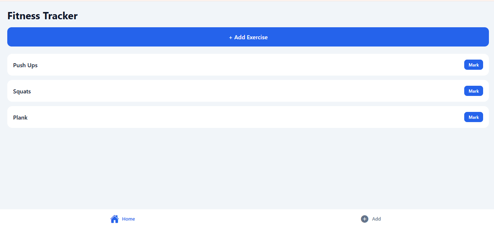

# Fitness App 💪

A modern fitness tracking app built using Expo (React Native).

## Features
- Workout tracking
- Clean and simple UI
- Fast performance

## Tech Stack
- React Native (Expo)
- JavaScript / TypeScript

## Run Locally
npm install
npx expo start

# 📱 Fitness App

## 🚀 Download & Install APK

Click the link below to download the app:

👉 https://expo.dev/accounts/tayyabkhanswati/projects/fitness-app/builds/06a38c6e-de99-406c-bf2e-02a18adfcfc8

## 📌 How to Install
1. Download APK from above link  
2. Open file on Android device  
3. Allow "Unknown Sources" if asked  
4. Install and run the app  

